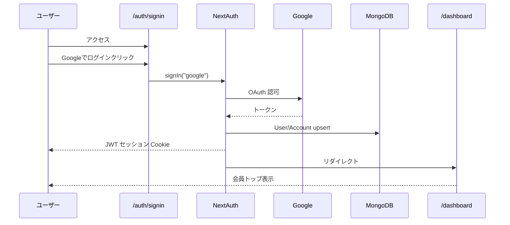
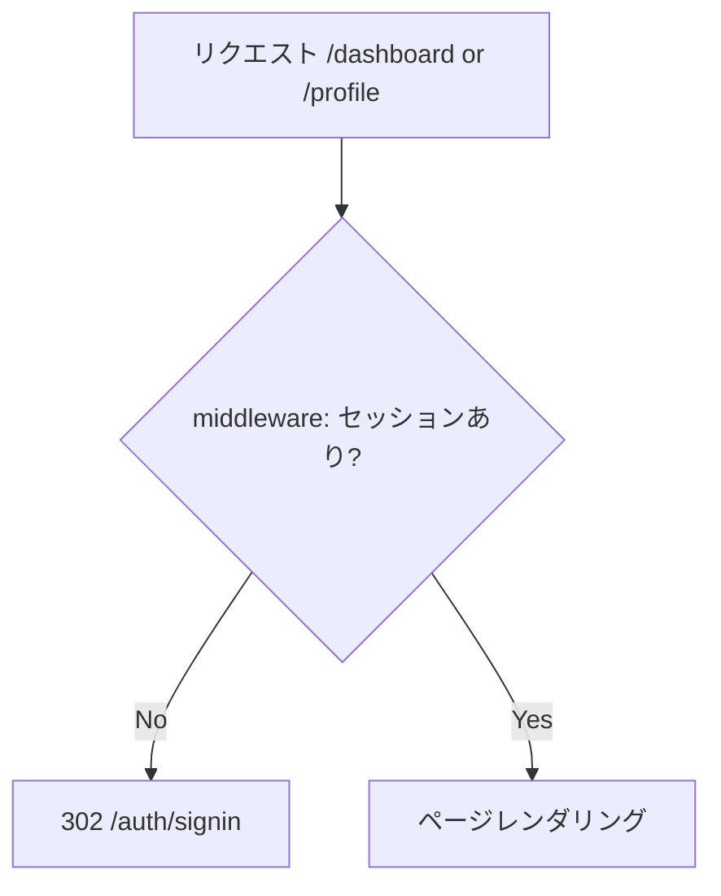
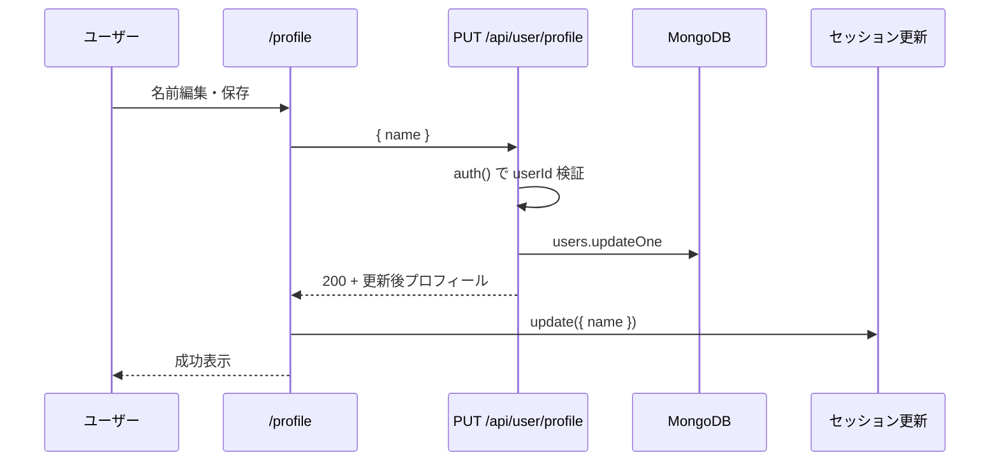

# AUTH-01 Google認証による会員制機能 — 設計書

| 項目 | 内容 |
|------|------|
| タスク ID | AUTH-01 |
| タスクタイトル | Google認証による会員制機能 |
| 作成日 | 2026-05-27 |
| 対象プロダクト | AIキャリア診断サービス（Stage2：会員基盤） |

---

## 1. ユーザーニーズ

### 1.1 背景

Stage1（LP）では診断・結果保存・会員機能はスコープ外だった。Stage2以降で「診断結果の保存」「再訪問」「パーソナライズ」を実現するには、**本人確認できる会員アカウント**が前提となる。

### 1.2 ペルソナ別ニーズ

| ペルソナ | ニーズ | 本機能での解決 |
|----------|--------|----------------|
| 就活中の学生 | 手軽にアカウントを作り、後から結果を見返したい | Google 1クリックログインで摩擦を最小化 |
| 転職検討の社会人 | 信頼できる認証方式で個人情報を扱いたい | Google OAuth（既知のIDプロバイダ） |
| キャリア迷子の社会人 | 複雑な登録フォームは避けたい | サインアップ専用画面を設けず、Googleログインのみ |

### 1.3 機能ニーズ（要約）

1. **ログインが簡単** — メール・パスワード登録なしで Google でサインインできる。
2. **会員専用エリア** — ログイン後のみダッシュボード・プロフィールにアクセスできる。
3. **自分の情報を確認・更新** — 名前など基本プロフィールを画面から編集・保存できる。
4. **セッション維持** — 再訪問時もログイン状態が分かり、未ログイン時はログインへ誘導される。

---

## 2. 仕様要件

### 2.1 機能概要

NextAuth.js（Auth.js v5）による Google OAuth 認証と、JWT セッション・MongoDB 永続化を組み合わせた会員制機能。

### 2.2 認証

| 要件 ID | 内容 |
|---------|------|
| AUTH-01-01 | NextAuth.js v5（Auth.js）で Google OAuth を実装する |
| AUTH-01-02 | セッションは JWT 方式とする（`session.strategy: "jwt"`） |
| AUTH-01-03 | ユーザー・Account は MongoDB Adapter で永続化する |
| AUTH-01-04 | ミドルウェアで `/dashboard`・`/profile` を保護し、未認証は `/auth/signin` へリダイレクトする |

### 2.3 画面

| パス | 要件 |
|------|------|
| `/auth/signin` | Google ログインボタン（MUI Button）。成功後 `/dashboard` へ遷移 |
| `/dashboard` | 会員専用トップ。ユーザー名・アバター表示、ナビゲーション（プロフィール・ログアウト等） |
| `/profile` | 名前・メール・アバター表示。名前編集フォーム（MUI TextField）と保存（MUI Button） |

### 2.4 API

| メソッド | パス | 説明 |
|----------|------|------|
| GET/POST | `/api/auth/[...nextauth]` | NextAuth 認証エンドポイント |
| GET | `/api/user/profile` | ログインユーザーのプロフィール取得（401 if 未認証） |
| PUT | `/api/user/profile` | プロフィール更新（現段階：`name`）。401 if 未認証 |

### 2.5 データモデル（User）

MongoDB `users` コレクション（Adapter 標準 + 拡張）:

| フィールド | 型 | 説明 |
|------------|-----|------|
| `_id` | ObjectId | ユーザー ID |
| `name` | string | 表示名（編集可） |
| `email` | string | Google メール |
| `image` | string | Google アバター URL |
| `emailVerified` | Date | メール確認日時 |
| `createdAt` | Date | 初回作成（signIn 時に設定） |
| `updatedAt` | Date | 最終更新（プロフィール保存時に更新） |

### 2.6 技術要件

- NextAuth.js v5、MongoDB Adapter、`mongodb` ドライバ
- MUI: `Button`, `Card`, `Avatar`, `TextField`
- 環境変数: `GOOGLE_CLIENT_ID`, `GOOGLE_CLIENT_SECRET`, `AUTH_SECRET`, `MONGODB_URI`
- 既存テーマ（ダーク／コスミック）に合わせた UI

### 2.7 受け入れ条件

- [ ] 未ログインで `/dashboard` または `/profile` にアクセスすると `/auth/signin` にリダイレクトされる
- [ ] Google ログイン後 `/dashboard` が表示され、名前・アバターが見える
- [ ] `/profile` で情報表示・名前変更・保存ができ、ダッシュボードの表示名も更新される
- [ ] `GET /api/user/profile` が認証済みユーザー JSON を返す
- [ ] `PUT /api/user/profile` が `name` を更新し `updatedAt` を記録する

---

## 3. 処理手順設計

### 3.1 ログインフロー

### 3.2 保護ルートアクセス

### 3.3 プロフィール更新

### 3.4 実装ファイル構成（予定）

| パス | 役割 |
|------|------|
| `auth.ts` | NextAuth 設定（Google, Adapter, JWT callbacks） |
| `middleware.ts` | 保護ルート |
| `lib/mongodb.ts` | MongoClient シングルトン |
| `lib/user.ts` | プロフィール取得・更新 |
| `app/api/auth/[...nextauth]/route.ts` | Auth ハンドラ |
| `app/api/user/profile/route.ts` | GET / PUT |
| `app/auth/signin/page.tsx` | ログイン画面 |
| `app/dashboard/page.tsx` | ダッシュボード |
| `app/profile/page.tsx` | プロフィール |
| `app/components/MemberLayout.tsx` | 共通ナビ・レイアウト |
| `app/components/ProfileForm.tsx` | 編集フォーム（Client） |
| `types/next-auth.d.ts` | セッション型拡張 |
| `.env.example` | 環境変数テンプレート |

### 3.5 実装順序

1. 依存パッケージ追加（`next-auth`, `@auth/mongodb-adapter`, `mongodb`）
2. `lib/mongodb.ts` → `auth.ts` → API ルート → `middleware.ts`
3. SessionProvider を `providers.tsx` に追加
4. 画面 3 種 + 共通レイアウト
5. `npm run build` で型・ビルド確認

---

## 4. 非機能・運用メモ

- **ローカル開発**: Google Cloud Console で OAuth リダイレクト URI に `http://localhost:3000/api/auth/callback/google` を登録する。
- **AUTH_SECRET**: `openssl rand -base64 32` 等で生成する。
- **MongoDB**: Atlas またはローカル。接続文字列は `MONGODB_URI` に設定する。
