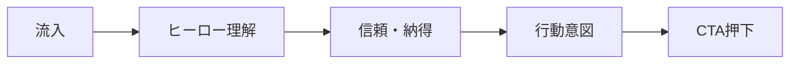

# ユーザージャーニーマップ

対象範囲：**LP訪問 → 内容理解 → CTA押下**（Stage1のトップページのみ。診断体験以降は別文書で拡張する前提）。

---

## ジャーニー概要図

---

## フェーズ別マップ

### フェーズ1：LP訪問（流入〜ファーストビュー）

| 項目 | 内容 |
|------|------|
| **ユーザー状態** | 検索・SNS・紹介などで初訪問。注意散漫。数秒で去りやすい。 |
| **タッチポイント** | ブラウザタブタイトル、OGP（将来）、ヒーロー（キャッチ・サブ・ビジュアル）、ファーストCTA。 |
| **行動** | スクロールするか、即離脱するかの分岐。 |
| **思考・感情** | 「自分向け？」「怪しくない？」「今すぐ必要？」 |
| **ペイン** | キャッチが抽象的、ロード時間、スマホで文字が小さい。 |
| **機会** | キャッチに「5問」「キャリア」を入れ、サブでベネフィットを1文で示す。 |
| **成功指標（LP内）** | ヒーローCTAのクリック率、スクロール深度（特徴セクション到達率）。 |

---

### フェーズ2：内容理解（特徴〜診断の流れ）

| 項目 | 内容 |
|------|------|
| **ユーザー状態** | サービス価値を比較検討。他の診断・記事・求人サイトと頭の中で並べている。 |
| **タッチポイント** | サービス特徴（3つ）、診断の流れ（3ステップ）、補足テキスト・図示。 |
| **行動** | 特徴を斜め読み → 流れで「自分がやること」を想像。 |
| **思考・感情** | 「5問で本当に足りる？」「AIって何をしてくれるの？」 |
| **ペイン** | 特徴が抽象的、ステップが曖昧、技術用語が多い。 |
| **機会** | 特徴は「悩み→解決」の形で3つに揃える。流れは「所要時間の目安」があれば安心感が増す。 |
| **成功指標（LP内）** | 下部CTAまでの到達率、特徴セクション滞在時間（将来計測）。 |

---

### フェーズ3：CTA押下（意思決定〜遷移）

| 項目 | 内容 |
|------|------|
| **ユーザー状態** | 試す／後で見るの判断。スマホなら親指で押しやすい位置が重要。 |
| **タッチポイント** | ヒーローCTA、ページ下部CTA、（任意）固定バーはStage2以降の検討事項。 |
| **行動** | 主CTAクリック。離脱ならブックマークやタブ残し。 |
| **思考・感情** | 「無料なら」「すぐ終わるなら」「個人情報は？」 |
| **ペイン** | CTAラベルが不明瞭、押下後の行き先が不安、フッターに信頼情報がない。 |
| **機会** | CTA文言は動詞＋成果（例：「5問の診断をはじめる」）。フッターに運営・ポリシー導線（プレースホルダ可）。 |
| **成功指標（LP内）** | CTAクリック率、クリック後の診断開始率（診断ページ実装後）。 |

---

## ペルソナ別の注目ポイント（LP上）

| ペルソナ | フェーズ1で強調 | フェーズ2で強調 | フェーズ3で強調 |
|----------|-----------------|-----------------|-----------------|
| A（学生） | 短時間・就活に使えるイメージ | 自己分析の「軸」が整理される | 無料・プライバシー |
| B（転職） | 忙しい人向け・次の一手 | 転職検討前の整理ツール | 信頼・具体性 |
| C（漠然） | 重くない・試しやすい | 次の数ヶ月の行動イメージ | 押し売り感のない表現 |

---

## Stage1のスコープ外（記録のみ）

- 診断設問画面、結果画面、会員登録、課金、メール配信。
- 上記はジャーニー上はCTAの「次」だが、本Stageの要件対象外。

---

## 文書管理

| 項目 | 内容 |
|------|------|
| バージョン | 1.0 |
| 作成日 | 2026-04-19 |
| 対象Stage | Stage1（LPのみ） |
